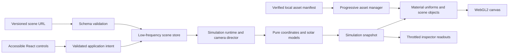
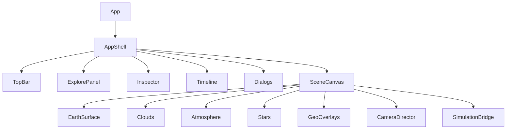

# Architecture

## 1. Chosen architecture

One static client application. React owns accessible DOM controls. React Three Fiber owns the Three.js scene lifecycle. Pure TypeScript owns coordinates, time, solar geometry and scene serialization. A small runtime bridge updates GPU uniforms/camera without broadcasting React state each frame.

This is a proposed stack for Terra, not a claim about the X project's implementation. Verify compatible stable dependency versions during TR-010 and record them in the lockfile and toolchain documentation.

| Concern | Default | Reason / boundary |
| --- | --- | --- |
| UI/build | React + strict TypeScript + Vite | Client-only interactive product; no SSR requirement |
| Graphics | Three.js + React Three Fiber | Programmable materials with React lifecycle integration |
| Helpers | Narrow Drei imports | Reuse proven controls/helpers without importing a whole demo stack |
| Rendering API | WebGL2 + GLSL | One supported baseline; WebGPU is deferred |
| State | Zustand + local React state | Low-frequency user intent; no per-frame store churn |
| Astronomy | Astronomy Engine adapter | Defined coordinate/time API instead of ad hoc Sun animation |
| UI styling | CSS Modules + tokens | Small explicit design system, no heavy component library requirement |
| Testing | Vitest + Testing Library + Playwright | Pure math, DOM interaction, real browser integration |
| Deployment | Static `dist`, Pages base `/terra/` | No server or runtime key required |

Three.js's documented WebGLRenderer uses WebGL2; do not promise WebGL1 fallback. Source: https://threejs.org/docs/pages/WebGLRenderer.html . A static poster/accessible information surface is the fallback when rendering is unavailable.

## 2. Data flow





## 3. File ownership and intended tree

```text
src/
  app/                 App.tsx, AppShell.tsx, providers.tsx
  components/ui/       Button, Slider, Dialog, Toggle, Tooltip
  features/explore/    search, place list, selected-place inspector
  features/timeline/   UTC controls, speed, scrubber
  features/lab/        lab controls, sunlight curve, explanation
  features/showcase/   tour, photo mode, presets, scene sharing
  features/settings/   quality, layers, help, credits
  scene/               SceneCanvas, EarthSurface, Clouds, Atmosphere, Stars
  scene/camera/        CameraDirector, orbit integration, fly-to math
  scene/materials/     surface/atmosphere/cloud shaders and typed uniforms
  scene/layers/        markers, graticule, selection
  simulation/          clock, coordinates, sun-provider, lab-model, sunlight
  state/               schema, scene-store, preferences, serialization
  assets/              manifest types, manager, quality tier selection
  data/                places, presets, tour
  styles/              tokens.css, global.css
  test/                fixtures, deterministic clock, test-only bridge
public/
  assets/earth/        verified texture derivatives only
  assets/fallback/     real rendered fallback poster after implementation
  basis/               matching local KTX2 transcoder files if used
scripts/               asset verification, docs checks, evidence utilities
tests/
  unit/                numeric and state tests
  e2e/                 browser workflows and failure tests
  visual/              controlled visual baseline specifications
  fixtures/            independently sourced numerical fixtures
  evidence/            small curated reports, not raw browser dumps
docs/                  specifications, decisions, progress and final case study
```

Do not create all folders as empty ceremony. Add modules when their task needs them. Keep `App.tsx` as composition, not a 2,000-line component. Imported shaders should be ordinary text/source modules supported by the chosen Vite setup; avoid unnecessary shader-loader plugins.

## 4. State and runtime contracts

```ts
type Vec3 = readonly [number, number, number];
type Quality = 'low' | 'medium' | 'high';
type LayerId = 'clouds' | 'atmosphere' | 'nightLights' | 'graticule' | 'places';

type EarthConfig = {
  mode: 'earth';
  epochMs: number;
  playing: boolean;
  speed: 1 | 60 | 3600;
};

type LabConfig = {
  mode: 'lab';
  elapsedSimMs: number;
  playing: boolean;
  speed: 1 | 60 | 3600;
  axialTiltDeg: number;
  seasonAngleDeg: number;
  solarDayHours: number;
  initialSubsolarLongitudeDeg: number;
};

type SceneConfig = {
  schemaVersion: 1;
  simulation: EarthConfig | LabConfig;
  camera: { latitudeDeg: number; longitudeDeg: number; distanceR: number };
  layers: Record<LayerId, boolean>;
  selectedPlaceId: string | null;
  selectedPoint: { latitudeDeg: number; longitudeDeg: number } | null;
};

type SimulationSnapshot = {
  mode: 'earth' | 'lab';
  evaluatedTimeMs: number;
  sunDirectionEarthFixed: Vec3;
  subsolarLatitudeDeg: number;
  subsolarLongitudeDeg: number;
  cloudPhase: number;
};
```

These are domain contracts, not a guarantee of exact third-party signatures. Validate all external scene data with a versioned schema. Use finite-number checks, enum validation, bounded strings and a small payload cap. Store preferences separately from scene content. Do not serialize renderer objects, materials, dates as locale strings, functions, or arbitrary URLs.

The runtime stores an anchor simulation value and monotonic real-time anchor. On pause, seek, speed change or mode switch, evaluate the old state first, then re-anchor. Readouts can update at 4–10Hz; the GPU and camera can update each frame. Avoid creating vectors, arrays, materials or closures repeatedly in hot loops when reuse is straightforward.

## 5. Rendering and coordinate ownership

Use the Earth-fixed coordinate contract in `SIMULATION_SPEC.md` everywhere. The Earth mesh stays fixed in Earth mode while Sun direction changes with epoch. Optional auto-orbit rotates the camera only. Do not rotate both the planet and Sun to account for the same physical day.

Surface material inputs: aligned day albedo, night emission, optional ocean mask/roughness/normal maps, Sun vector and controlled appearance constants. Clouds use their own shell/material and the same light direction. The atmospheric shell is independent. Stars are a seeded point cloud with no physical sky claim.

Color textures require correct sRGB interpretation; scalar data maps remain non-color. Perform lighting in linear space and apply tone mapping/output conversion once. Custom ShaderMaterial output must follow the selected Three.js version's supported color/tone-mapping chunks or an explicitly tested equivalent. Avoid double-gamma correction. Source: https://threejs.org/manual/en/color-management.html .

Do not make optional bloom the source of the underlying day/night effect. First produce a strong scene with surface/cloud/atmosphere materials alone. Postprocessing is allowed only if its visual gain survives measurement and lower tiers can disable it cleanly.

## 6. Asset lifecycle

Render a low-resolution complete Earth before loading high-resolution upgrades. An asset manager owns progress, deduplicated requests, cancellation, active quality tier, and references to shared GPU resources. Keep old textures alive until their replacements are uploaded and renderable, then release the old tier when no consumers remain.

KTX2 is a candidate production format. If used, ship the matching transcoder locally, call renderer capability detection before loading, bound worker count, and provide a tested ordinary-image fallback. See https://threejs.org/docs/pages/KTX2Loader.html . File compression and GPU residency are separate budgets.

Every geometry, material, texture, render target, event listener and loader worker needs an owner and teardown path. Three.js resources are not all reclaimed just because a component disappears. See https://threejs.org/manual/en/how-to-dispose-of-objects.html . Test remounts, quality switches and context recovery rather than relying on a single happy-path load.

## 7. Camera controller arbitration

Exactly one controller owns the camera at a time: `orbit`, `flyTo`, `tour` or `photoOrbit`. A transition acquires ownership, disables conflicting controls, and releases cleanly on completion/cancellation. Pointer/wheel/manual keyboard input cancels programmatic motion before applying the new input.

Interpolate unit directions on the sphere and radial distance separately. Handle nearly parallel and antipodal directions explicitly. Recompute a stable up vector or use a constrained look-at with pole clamps. A panel resize changes viewport/aspect, not geographic position.

## 8. Worker strategy

The core ephemeris and a 361-sample daily curve should first be profiled on the main thread with caching. Add a dedicated worker only if repeated sampling causes measurable interaction stalls. A worker request must include a monotonic request ID and the exact model input; stale replies must be dropped, errors surfaced, and pending work terminated on mode change/unmount. Transfer typed arrays where useful; avoid copying large arrays per frame.

Do not move the whole renderer to OffscreenCanvas in the core release. It complicates interaction, debugging and browser support without being justified by the current scope.

## 9. Persistence, URLs and security

Precedence: explicit URL scene → curated showcase; local preferences independently apply. Saved scene restoration is explicit. Hash-based state avoids static-host routing problems and does not require a server; keep it versioned and bounded. Support unknown/corrupt versions with a recoverable warning and the default scene.

Only allow known place/preset IDs and known model parameters. Do not resolve arbitrary remote texture URLs from a shared link. No secrets, user-identifying data or analytics are needed. Data and assets used by the core app are same-origin and credited.

## 10. Deployment boundaries

The app must work both at `/terra/` and at `/` when configured appropriately. Asset URLs must use the build base rather than hardcoded root paths. Test the real `dist` build, not just Vite's development server. The Pages workflow is implementation work; it requires appropriate repository settings/permissions. Record success only after the public site and its assets are actually checked.

The Vite deployment guide documents static output and Pages base handling: https://vite.dev/guide/static-deploy.html . Read current guidance at implementation time before fixing workflow versions. Do not add environment variables for services the app does not use.
