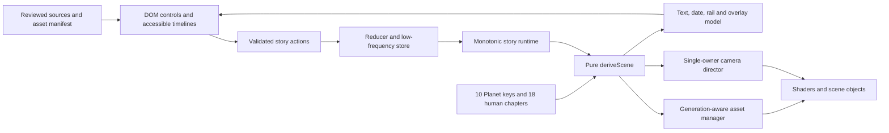

# Terra v2 — implementation architecture

## 1. Stack and boundaries

One static React + TypeScript + Vite application. Three.js through React Three Fiber renders the globe; narrowly imported Drei helpers may provide controls. Zustand stores low-frequency user intent/bookmarks; a pure reducer and small runtime evaluate narrative state. CSS Modules/tokens style semantic DOM controls. Vitest/Testing Library cover logic and UI, Playwright covers production-build workflows and visual regressions.

This is Terra's chosen implementation, **not confirmation of the original website's stack**. The official R3F repository describes its React/Three.js integration: https://github.com/pmndrs/react-three-fiber . Verify compatible stable versions during bootstrap; pin the runtime, package manager and lockfile. Do not guess that independently choosing the latest React and R3F majors is compatible.

Use WebGL2 as the baseline. Current Three.js WebGLRenderer documents that API: https://threejs.org/docs/pages/WebGLRenderer.html . Provide an accessible poster/story-reader fallback, not a promised WebGL1 renderer. No backend, SSR requirement, paid API, live geodata request, account, database, Temporal, AI service or monorepo is needed. Offline asset preparation may use Python/GPlates without making them runtime dependencies.

## 2. Proposed module tree

```text
src/
  app/                 App.tsx, AppShell.tsx, route-state.ts
  components/ui/       Button, SegmentedControl, Dialog, Slider, Tooltip
  features/planet/     PlanetIntro, PlanetNarrative, GeologicalTimeline
  features/civilization/ CivilizationIntro, ChapterNarrative, ChapterTimeline
  features/story/      TransportControls, SpeedMenu, ChapterDrawer
  features/sources/    SourcesDrawer, ChapterSources, Credits
  features/settings/   QualityMenu, Help, ShareScene
  story/               types, schema, reducer, transport, derive-scene
  story/               geological-mapping, date-formatting, serialization
  scene/               GlobeCanvas, Surface, Clouds, Atmosphere, Space
  scene/materials/     modern-earth, paleo-surface, early-earth, atmosphere
  scene/camera/        CameraDirector, frame-composition, spherical-path
  scene/overlays/      CurrentRegions, EarlierSites, Labels, StoryRoutes
  geo/                 coordinates, occlusion, route-math
  assets/              manifest-schema, manager, residency-cache, quality
  data/                planet-anchors, civilization-chapters, sources, camera-presets
  styles/              tokens.css, global.css
public/assets/         verified optimized runtime assets only
scripts/assets/       acquisition, reconstruction, rasterization, compression, verification
scripts/               content verification, documentation checks
 tests/                unit, component, e2e, visual fixtures
 docs/                 specifications and curated implementation evidence
```

The leading space before `tests/` in this illustrative tree has no semantic meaning; use the normal root `tests/` folder. Add modules when needed, not dozens of empty placeholder directories. Keep App.tsx as composition glue. Renderer/material ownership must not be spread across unrelated global effects.

## 3. Data flow



A single renderer is reused across section switches. Do not remount a new WebGL context for every chapter. Scene state is not a collection of independent `setInterval` callbacks. Assets and numerical mappings remain testable without a browser.

## 4. Domain contracts

```ts
type Section = 'planet' | 'civilization';
type Appearance = 'natural' | 'after-dark' | 'blue-hour';
type TransportStatus = 'intro' | 'paused' | 'playing' | 'scrubbing' | 'buffering' | 'complete';
type Quality = 'low' | 'medium' | 'high';
type CameraPose = { latitudeDeg: number; longitudeDeg: number; distanceR: number };

type StoryLocation =
  | { section: 'planet'; position: number; intro: boolean }
  | { section: 'civilization'; chapterId: string | null; localProgress: number; intro: boolean };

type StoryState = {
  version: 2;
  location: StoryLocation;
  status: TransportStatus;
  speed: 1 | 2 | 5;
  appearance: Appearance;
  camera: CameraPose;
  cameraOwner: 'user' | 'chapter' | 'reset';
  overlays: { currentRegions: boolean; earlierSites: boolean };
  openPanel: null | 'chapters' | 'sources' | 'settings';
};

type SceneProjection = {
  revision: number;
  narrativeId: string;
  displayDate: string;
  assetKeys: readonly string[];
  blend: number;
  cameraTarget: CameraPose;
  visibleOverlayIds: readonly string[];
  allowModernCityEmission: boolean;
  interpretation: 'conceptual' | 'model-informed' | 'modern-reference';
};
```

Refine these contracts consistently when coding, using discriminated unions to reject impossible mode/appearance combinations. Stable chapter IDs come from the catalogue; no free-form remotely supplied URLs. Preferences and per-section bookmarks live outside a shared scene's serialized domain. Validate all imports with finite/bounded numbers, known enums/IDs and a small size cap.

## 5. Rendering layers

Surface: aligned day/albedo, optional roughness/ocean mask, historical night emission, or two era-correct paleogeographic masks and procedural appearance parameters. Early Earth uses a separate conceptual material. Clouds and atmosphere use thin separate shells with correct depth order. Decorative space is minimal. Surface labels/routes/regions use a common coordinate frame and Earth occlusion.

Keep color textures in sRGB and masks/normal/roughness/SDF data non-color. Perform blending/lighting in the appropriate linear working space and apply tone mapping/output conversion once. Custom ShaderMaterial needs explicit output handling; the official guide documents the relevant shader conversion: https://threejs.org/manual/en/color-management.html . Do not combine a baked night-Earth RGB photograph with emission as if all its dark land pixels were city lights; choose/derive an emission signal with documented treatment and visual checks.

Physical atmosphere integration, global illumination, DOF and complex postprocessing are not necessary for the reference effect. Prefer an inspectable small shader with restrained parameters. Add optional selective bloom only after the base material passes and the performance impact is measured.

## 6. Frame loop and animation

The frame loop evaluates the anchored runtime, updates reusable uniforms/objects and advances the single active camera owner. React rerenders on chapter/control changes, not every animation frame. Update visible continuously changing geological age at a bounded rate; animation remains smooth without forcing the entire app to rerender at 60Hz.

Opening a panel, manual interaction, section switch, visibility loss or a required asset wait pauses/re-anchors transport. Avoid per-frame allocation of materials/textures/vectors. Derive overlays from the selected chapter rather than incrementally mutating a permanent visited-sites set that cannot rewind correctly.

Default camera presets are data-driven and must be checked visually per chapter. A projection offset frames the globe beside the text; do not alter geographic coordinates to move it into the right side of the screen. Explicitly test that pointer picking/orbit math still matches the rendered viewport after resizing and responsive changes.

## 7. Asset ownership and quality

The manager handles request deduplication, current revision, cancellation, prefetch, fallback and residency. GPU readiness means successful upload and at least one render with the intended asset set, not merely completion of HTTP requests. Expose a test-only `sceneReady(revision)` signal for deterministic screenshots; exclude debug mutation APIs from production.

Begin with a complete era-correct preview, not a blank sphere waiting for every high-quality key. At a random seek, commit text/date/scene consistently once the required low-resolution set is ready. Discard stale completion callbacks. Keep a bounded adjacent-key cache and dispose evicted textures/materials/render targets when no consumers own them.

KTX2 is optional if it improves measured delivery/residency. Its loader requires renderer capability detection and matching transcoder assets; keep those local and cap worker count. Source: https://threejs.org/docs/pages/KTX2Loader.html . Ordinary-image fallbacks must fit the same memory budget; compressed download size is not GPU-memory size.

## 8. Worker and offline policy

Do not build a backend service to generate ancient Earth at runtime. Fetch/prepare permitted model data offline into reproducible, checksummed runtime derivatives. Pygplates or equivalent can be a documented development-only preparation step. Runtime uses compact masks/textures and chapter data. A worker is justified for expensive decode/preparation only after profiling; do not move all rendering into OffscreenCanvas by default.

## 9. Static deployment and security

Build for GitHub Pages base `/terra/`, with `/` configurable for other hosts. All local asset/transcoder paths derive from the Vite base. Store scene state in a versioned hash or a similarly static-host-safe URL; unknown versions recover to the intro with a message. Browser back/forward and copied scene URLs must not create network requests to arbitrary user-controlled hosts.

No secret, API key, user identifier, analytics or location permission is needed. Use same-origin runtime assets and ordinary source links. Do not add environment placeholders for nonexistent services. Configure Pages only through authorized repository settings; public availability is a separate verified release result. Vite's official deployment guide explains base/output behavior: https://vite.dev/guide/static-deploy.html .

## 10. Verification ownership

Pure logic owner: mapping, dates, transport, validation and overlay membership. Rendering owner: geometry/materials/assets and GPU lifecycle. Interface owner: narrative shell, panels, input routing/accessibility. One integrator owns shared contracts, camera director and lockfile. Parallel agents need separate worktrees and nonoverlapping file assignments. Merge small changes and rerun the complete browser journey frequently.
