# Terra implementation roadmap

## How to execute

There are **62 core tasks** across M0–M7 and **8 optional extensions**. All implementation tasks start unchecked. Documentation existing in the planning packet does not mean implementation verification has occurred. Stable task IDs are intentionally grouped with gaps between milestones.

Each task specifies dependencies, work, intended files and acceptance evidence. Read the corresponding product/visual/numerical specification before coding. Use `PROGRESS.md` for actual status, commit IDs, commands, screenshots and blockers. GitHub epic issues mirror these task groups; this file is authoritative.

Complete M0, then M1's real vertical slice, before polishing all UI panels. Do not parallelize around unresolved coordinate or state contracts. Pure model/UI work may proceed in separate worktrees once contracts are stable. One owner integrates materials, scene root and shared state.

```mermaid
flowchart LR
  M0[M0 Evidence and feasibility] --> M1[M1 Vertical slice]
  M1 --> M2[M2 Rendering]
  M2 --> M3[M3 Time and sunlight]
  M3 --> M4[M4 Exploration]
  M4 --> M5[M5 Showcase interactions]
  M5 --> M6[M6 Hardening]
  M6 --> M7[M7 Verification and release]
  M7 -. optional .-> EXT[TR-080 to TR-087]
```

The milestone graph is a safe default sequence. Task-level dependencies permit focused parallel work within it. No optional task is needed for core completion.

## M0 — Evidence, assets and feasibility

**Exit gate:** the implementer knows exactly what is proposed versus observed, has viable asset sources, understands the coordinate/model contracts, and has selected desktop/mobile visual targets.

### TR-001 — Reassess the supplied reference without inventing observations

- [ ] Complete and record evidence.
- **Dependencies:** none. **Files:** `docs/REFERENCE_ANALYSIS.md`, `docs/PROGRESS.md`.
- **Work:** try the exact X post/video in the available browser and any accessible author-linked demo. If accessible, record metadata and an actual timestamped interaction/frame inventory. If not, record the failure and explicitly proceed with the proposed Earth-observatory baseline. Do not republish raw media without rights.
- **Acceptance:** every source-feature claim is classified; no fabricated timestamps, stack or controls. The implementer acknowledges that exact reference parity remains unverified when access fails. This task can finish with a documented inaccessible-reference outcome; the separate parity claim cannot.
- **Verification:** review the evidence ledger against actual retrieved material and document any baseline mismatch risk.

### TR-002 — Prove the core asset sources are usable

- [ ] Complete and record evidence.
- **Dependencies:** TR-001. **Files:** `docs/ASSETS_AND_SOURCES.md`, local acquisition records, initial preview asset.
- **Work:** choose exact day/night image items; verify download, projection, credit, observation period and terms. Identify a permitted cloud source or original procedural fallback. Determine whether a reliable ocean mask is available. Download a small preview and check geographic alignment manually.
- **Acceptance:** day and night assets have a concrete permitted acquisition path; every uncertain auxiliary asset has an explicit fallback. No reliance on the reference site's hotlinks. No blanket claim that all NASA material is unrestricted.
- **Verification:** inspect downloaded previews and record exact URLs, dimensions and SHA-256 values; record terms checks rather than guessed license names.

### TR-003 — Inspect the repository and define toolchain constraints

- [ ] Complete and record evidence.
- **Dependencies:** none. **Files:** `docs/DECISIONS.md`, `docs/PROGRESS.md`.
- **Work:** inspect current branch, existing files, package configuration and user changes. Confirm this plan has not been superseded by code. Define a task branch/worktree and a compatible stable Node/pnpm/React/Vite/R3F/Three.js set to verify during bootstrap.
- **Acceptance:** no unrelated files or global configuration are changed; potential peer-version conflicts are resolved before installing. Reuse real existing conventions if the repo has advanced since planning.
- **Verification:** record repository baseline and proposed version/compatibility sources. Do not record secrets or private machine paths.

### TR-004 — Establish actual visual targets

- [ ] Complete and record evidence.
- **Dependencies:** TR-001. **Files:** `docs/VISUAL_SPEC.md`, permitted concepts under `docs/design/`.
- **Work:** create/review a complete desktop primary screen and mobile inspector/lab composition. Use generated concepts where available, or an explicit equivalent visual reference; label concepts as concepts. Lock tokens, stage size, panel anatomy, type scale and motion rules.
- **Acceptance:** the target covers the full simulator surface, not just a hero image. The planet is dominant, controls are legible and mobile composition is intentional. Do not call an agent-selected design user-approved without actual approval.
- **Verification:** inspect the targets visually and write a short design decision with five concrete composition criteria.

### TR-005 — Verify astronomy conventions and define independent fixtures

- [ ] Complete and record evidence.
- **Dependencies:** none. **Files:** `docs/SIMULATION_SPEC.md`, `docs/ASSETS_AND_SOURCES.md`, fixture source notes.
- **Work:** verify the current astronomy API's vector frame, RA units, EQJ/EQD conversion and sidereal-time semantics. Verify twilight terminology against an authoritative source. Choose independent solar-position fixture sources and expected conventions/tolerances.
- **Acceptance:** there is one documented east-positive, Y-up Earth-fixed mapping and no ambiguity about degrees/hours/radians or geometric versus refracted altitude. Fixture provenance is planned, not invented.
- **Verification:** review equations and API signatures. Numerical implementation/tests occur in TR-015 and TR-031; do not claim them already passed.

### TR-006 — Freeze the core contract and risk register

- [ ] Complete and record evidence.
- **Dependencies:** TR-002, TR-003, TR-004, TR-005. **Files:** `docs/DECISIONS.md`, `docs/PROGRESS.md`.
- **Work:** reconcile assets, design, coordinates, state shape, performance targets and deployment constraints. Explicitly retain the 62-task core and deferred extensions. Record unresolved reference access separately from build blockers.
- **Acceptance:** no contradictory model/UI contract remains; a developer can bootstrap without choosing a new product. Real blockers have a bounded workaround or clear status.
- **Verification:** a brief readiness review links each risk to a task and names the next dependency-ready task.

## M1 — A functioning vertical slice

**Exit gate:** a real Earth renders in a real browser, loads an actual approved texture, supports orbit/zoom, and uses tested coordinates. A static mockup does not pass.

### TR-010 — Bootstrap the single application

- [ ] Complete and record evidence.
- **Dependencies:** TR-006. **Files:** `package.json`, one lockfile, `tsconfig*`, `vite.config.ts`, runtime/package-manager pins, `.gitignore`, `index.html`.
- **Work:** scaffold React/TypeScript/Vite without a monorepo; install verified compatible stable dependencies; enable strict TypeScript; set up a configurable base for `/terra/` and `/`. Avoid unused backend dependencies.
- **Acceptance:** a clean install is reproducible and a minimal production build succeeds. Runtime and package-manager requirements are documented. No multiple lockfiles or floating production dependency tags.
- **Verification:** record exact versions and outputs from install, typecheck and build.

### TR-011 — Establish meaningful checks from the start

- [ ] Complete and record evidence.
- **Dependencies:** TR-010. **Files:** lint/format config, Vitest config, initial test helpers, package scripts.
- **Work:** implement lint, typecheck, unit and docs-check scripts with real checks; add an initial state/schema smoke test. Define asset verification behavior for the current small verified asset set. Keep `check` fail-fast.
- **Acceptance:** each script executes actual work; a deliberately failing test exits nonzero. Document future script additions instead of shipping `echo success` stubs.
- **Verification:** run positive and negative smoke cases and remove temporary deliberate failures.

### TR-012 — Build the accessible application shell

- [ ] Complete and record evidence.
- **Dependencies:** TR-010, TR-004. **Files:** `src/app/*`, `src/components/ui/*`, `src/styles/*`.
- **Work:** implement stage layout, compact top bar, rail, timeline region, panel/dialog primitives and focus handling from the visual target. Keep feature controls hidden or honestly disabled until wired; remove all such placeholders before core release.
- **Acceptance:** desktop and narrow layout render without overflow; controls use semantic HTML and deliberate typography. The stage is the dominant surface.
- **Verification:** browser screenshots at 1440×900 and 390×844; initial keyboard traversal and 200% text-zoom check.

### TR-013 — Initialize the WebGL2 scene and readiness lifecycle

- [ ] Complete and record evidence.
- **Dependencies:** TR-010, TR-012. **Files:** `src/scene/SceneCanvas.tsx`, scene error boundary, readiness state.
- **Work:** create one R3F canvas, perspective camera, controlled output/tone mapping and basic render diagnostics. Add capability detection and a usable non-WebGL fallback. Define readiness only after required visible resources have loaded and rendered.
- **Acceptance:** actual WebGL2 renders; errors do not leave a silent black screen; React remounts do not create duplicate animation loops.
- **Verification:** inspect a real browser canvas and console; test the unsupported-capability path through a controlled test seam.

### TR-014 — Render a preview Earth with correct geography

- [ ] Complete and record evidence.
- **Dependencies:** TR-013, TR-002. **Files:** `src/scene/EarthSurface.tsx`, preview texture metadata.
- **Work:** render the radius-1 sphere with a permitted low-resolution day texture and simple deliberate lighting. Normalize image orientation/UV behavior once; do not accumulate magic rotations.
- **Acceptance:** Africa/Europe, the Americas, Australia and date-line edges are correctly oriented and located. The north pole is north; the map is neither mirrored nor vertically inverted.
- **Verification:** capture annotated landmark checks and inspect the seam at the closest allowed camera distance.

### TR-015 — Implement and test coordinate primitives

- [ ] Complete and record evidence.
- **Dependencies:** TR-011. **Files:** `src/simulation/coordinates.ts`, coordinate unit tests.
- **Work:** implement degrees/radians helpers, longitude normalization, lat/lon↔vector conversion, pole behavior, angular separation and canonical UV helpers. Keep pure functions free of React/Three.js.
- **Acceptance:** all anchors and round trips in `SIMULATION_SPEC.md` pass; nonfinite/zero-vector inputs fail safely; poles do not produce misleading longitude precision.
- **Verification:** deterministic unit fixtures and randomized round-trip tests including ±180°, near poles and both hemispheres.

### TR-016 — Add constrained orbit and zoom

- [ ] Complete and record evidence.
- **Dependencies:** TR-013, TR-015. **Files:** `src/scene/camera/*`.
- **Work:** wire pointer/touch/trackpad orbit, distance limits, no pan, stable pole behavior, reset view and initial camera intent. Establish camera ownership states even before tours exist.
- **Acceptance:** camera never enters Earth or flips uncontrollably; controls do not react to panel interactions; default distance/FOV matches the visual target.
- **Verification:** drag, pinch/wheel, resize, reset and rapid input in a real browser; test camera-bound math separately.

### TR-017 — Pass the vertical-slice review

- [ ] Complete and record evidence.
- **Dependencies:** TR-011, TR-012, TR-014, TR-015, TR-016. **Files:** `tests/e2e/smoke.spec.ts`, curated screenshots, `docs/PROGRESS.md`.
- **Work:** launch the actual production preview, load the initial scene and exercise orbit/zoom/reset. Inspect the visual baseline before moving to complex materials.
- **Acceptance:** a real textured planet, usable chrome and correct geography exist; no blank-canvas or console-error happy path. This is not satisfied by scaffolding alone.
- **Verification:** attach screenshots, browser details, basic test output and a five-point visual mismatch/fix ledger.

## M2 — Cinematic Earth rendering

**Exit gate:** strong day/night appearance, coherent clouds/atmosphere, a viable quality pipeline and a tested resource lifecycle.

### TR-020 — Implement the reproducible asset pipeline

- [ ] Complete and record evidence.
- **Dependencies:** TR-017, TR-002. **Files:** `scripts/assets/*`, `public/assets/manifest.json`, typed asset manager.
- **Work:** acquire approved originals; produce preview/low/medium and optional high derivatives; record hashes, dimensions, observation periods, color purpose and transformation recipes. Add local KTX2 support only if its measured benefit justifies it.
- **Acceptance:** `assets:verify` catches missing files, hashes, credits and pending entries. Runtime paths respect the build base. No enormous raw scientific images enter normal Git history.
- **Verification:** rebuild at least one derivative reproducibly, validate the manifest and test an intentional corrupt/missing asset.

### TR-021 — Build the surface material and correct color pipeline

- [ ] Complete and record evidence.
- **Dependencies:** TR-020, TR-015. **Files:** `src/scene/materials/surface*`, `EarthSurface.tsx`.
- **Work:** implement linear-space illumination, sRGB albedo/emission handling and one output conversion. Add ocean response with a verified mask or document a restrained no-mask fallback. Expose named appearance constants, not scattered literals.
- **Acceptance:** the surface is neither washed out nor double-gamma darkened; highlights do not coat land indiscriminately. Material compiles on the baseline browser matrix.
- **Verification:** inspect day/ocean/coastline close-ups; compare a neutral color fixture; capture shader compile failures as test errors.

### TR-022 — Implement coherent terminator and city lights

- [ ] Complete and record evidence.
- **Dependencies:** TR-021. **Files:** surface shader, lighting fixtures.
- **Work:** use a normalized Earth-fixed Sun direction to blend daylight and historical night emission. Start with controlled fixture vectors; TR-032 connects real timeline values. Keep artistic twilight width separate from numerical altitude.
- **Acceptance:** night lights appear only on the dark side with a smooth boundary; day/night textures align geographically. No city texture through daylight clouds/oceans as an unmasked overlay.
- **Verification:** render three fixed Sun directions and confirm that light/dark locations match dot-product expectations.

### TR-023 — Add the cloud layer

- [ ] Complete and record evidence.
- **Dependencies:** TR-020, TR-022. **Files:** `Clouds.tsx`, cloud material, artistic phase helper.
- **Work:** use a separate shell near radius 1.006 with a permitted alpha texture or original procedural texture. Reuse the Sun direction, correct transparency/depth behavior and deterministic artistic phase.
- **Acceptance:** no opaque double Earth, black alpha fringes or visible seam. Clouds do not pretend to be live weather; movement is reproducible.
- **Verification:** inspect limb/day/night/seam views, toggle repeatedly and check stability at near/far camera distances.

### TR-024 — Add a restrained atmosphere

- [ ] Complete and record evidence.
- **Dependencies:** TR-022. **Files:** `Atmosphere.tsx`, atmosphere material.
- **Work:** implement a thin, view-dependent sunlight-weighted limb shell near radius 1.025. Treat this as an artistic approximation. Tune depth/culling/transparency without masking surface defects with glow.
- **Acceptance:** the lit limb looks atmospheric, not like a neon ring; dark-side glow is weaker; the shell does not detach or flicker. No claim of physically integrated atmospheric scattering.
- **Verification:** compare wide/close, day/terminator/night and low/high DPR screenshots.

### TR-025 — Finish the background and visual hierarchy

- [ ] Complete and record evidence.
- **Dependencies:** TR-023, TR-024. **Files:** `Stars.tsx`, scene appearance settings.
- **Work:** add a low-density fixed-seed star field and refine planet/background contrast. Keep stars decorative and cheap. Evaluate any bloom in an isolated comparison; omit it if it weakens detail or costs too much.
- **Acceptance:** stars never compete with Earth or show through it; the scene looks finished with postprocessing disabled. No random per-load star changes in test fixtures.
- **Verification:** before/after visual review and renderer draw-call/resource counts.

### TR-026 — Implement progressive quality tiers

- [ ] Complete and record evidence.
- **Dependencies:** TR-020, TR-025. **Files:** asset tier selector, settings quality control, scene quality adapter.
- **Work:** define low/medium/high texture and geometry tiers with DPR caps of approximately 1/1.5/2. Render the preview first, upgrade atomically and retain a user override. Capability-gate high assets; lower resolution when ordinary-image fallbacks would exceed memory targets.
- **Acceptance:** quality changes preserve camera/time/selection and do not blank the globe. Initial load does not download every high-tier asset. All tiers remain visually coherent.
- **Verification:** network inspection, repeated switches, memory estimates and side-by-side tier screenshots.

### TR-027 — Prove rendering resource ownership

- [ ] Complete and record evidence.
- **Dependencies:** TR-026. **Files:** loader/resource teardown paths, lifecycle tests.
- **Work:** dispose replaced/unmounted textures, geometries, materials, render targets, listeners and transcoder workers according to ownership. Avoid disposing shared resources still in use. Test development remount behavior.
- **Acceptance:** resource counts plateau after warm-up across repeated quality switches and scene remounts. No duplicated loops, stale loads replacing new ones, or increasing worker count.
- **Verification:** record a 20-cycle resource-count test and investigate growth rather than labeling estimates as measured GPU bytes.

## M3 — Time and sunlight simulation

**Exit gate:** one continuous clock drives the Earth Sun, materials and readouts; the lab is separate, understandable and numerically tested.

### TR-030 — Implement the anchored simulation clock

- [ ] Complete and record evidence.
- **Dependencies:** TR-015, TR-017. **Files:** `src/simulation/clock.ts`, runtime bridge, clock tests.
- **Work:** implement monotonic anchor evaluation, play/pause, seek, speed changes, time bounds and hidden-tab pause behavior. Never accumulate physical time from frame count.
- **Acceptance:** continuity and frame-schedule independence match the numerical specification; hidden periods do not cause huge jumps.
- **Verification:** 1×/60×/3600×, pause, seek, rapid speed changes, visibility and date-boundary unit tests.

### TR-031 — Implement and independently validate the Sun adapter

- [ ] Complete and record evidence.
- **Dependencies:** TR-030, TR-005. **Files:** `src/simulation/sun-provider.ts`, numerical fixtures/tests.
- **Work:** wrap the verified astronomy APIs, transform J2000 to of-date coordinates, derive Earth-fixed subsolar direction and normalize. Implement bounded caching/vector interpolation. Acquire documented independent comparison fixtures.
- **Acceptance:** correct units/frame and no nonfinite values; independent angular discrepancy meets the ≤0.25° display target; interpolation adds less than 0.05° on tested fixtures.
- **Verification:** equinox/solstice, midnight, leap-day and year-boundary fixtures with provenance. Do not compare only against another call to the same adapter.

### TR-032 — Connect a single snapshot to materials and readouts

- [ ] Complete and record evidence.
- **Dependencies:** TR-031, TR-022, TR-023, TR-024. **Files:** `SimulationBridge`, material uniform updates, pure sunlight helpers.
- **Work:** use one snapshot for surface/cloud/atmosphere light direction and numeric solar altitude. Keep frame-loop mutation outside React state broadcasts. The Earth surface remains fixed; camera motion is separate.
- **Acceptance:** changing camera position does not change a selected location's illumination; time changes move the terminator coherently; no duplicate daily rotation.
- **Verification:** numeric/visual fixture comparisons at three places and three epochs; check React update rates during playback.

### TR-033 — Build complete timeline controls

- [ ] Complete and record evidence.
- **Dependencies:** TR-030, TR-032, TR-012. **Files:** `src/features/timeline/*`.
- **Work:** wire play/pause, speeds, UTC date/time input, daily scrubber, Now and reset. Pause during/after scrubbing, preserve valid input on errors, and update the day at midnight.
- **Acceptance:** all controls affect the authoritative clock; UTC is explicit; changing a slider does not silently reset camera/layers. Now does not label historical textures live.
- **Verification:** component tests plus browser checks for keyboard editing, invalid dates, leap day, midnight and rapid interactions.

### TR-034 — Implement the isolated sunlight lab

- [ ] Complete and record evidence.
- **Dependencies:** TR-030, TR-032. **Files:** `src/simulation/lab-model.ts`, lab state/control modules.
- **Work:** implement the specified tilt/season/solar-day model, parameter validation, phase-preserving duration changes and Earth-state restoration. Show a persistent educational-simulation explanation and separate lab time.
- **Acceptance:** zero tilt eliminates seasonal declination; day-duration changes do not jump phase; leaving the lab restores the previous Earth state paused. No temperatures or climate claims.
- **Verification:** model invariants, parameter limits, mode-switch preservation and UI label tests.

### TR-035 — Add the daily direct-sunlight curve

- [ ] Complete and record evidence.
- **Dependencies:** TR-034, TR-015. **Files:** sunlight sampling helper, lab chart and accessible table/summary.
- **Work:** sample 361 phases using the same model as the scene; cache by parameters/location and show an honest empty state without a selection. Use a dimensionless 0–1 axis and simulated-hour x axis. Add a worker only if profiling proves necessary.
- **Acceptance:** all values are finite/bounded, endpoints agree and longer days stretch time rather than inventing higher intensity. The curve has an accessible nonvisual equivalent.
- **Verification:** equatorial, polar, zero-tilt and 60°-tilt fixtures. Selection wiring is completed in M4; use explicit test coordinates here.

### TR-036 — Author deterministic Earth and lab presets

- [ ] Complete and record evidence.
- **Dependencies:** TR-033, TR-034. **Files:** `src/data/presets.ts`, preset schema/tests.
- **Work:** define Blue Marble, Night Lights, Terminator, Polar Day and three lab presets with explicit camera/time/layers/parameters. Verify seasonal names against the model rather than arbitrary dates.
- **Acceptance:** presets are reproducible and do not depend on wall-clock startup time. Reapplying a preset fully resets its defined state and clears incompatible mode state.
- **Verification:** schema tests and actual screenshots for each preset; numerical proof for Polar Day.

### TR-037 — Audit numerical and temporal integration

- [ ] Complete and record evidence.
- **Dependencies:** TR-031, TR-032, TR-033, TR-034, TR-035, TR-036. **Files:** integration tests, `docs/PROGRESS.md`.
- **Work:** exercise complete timeline/mode/preset transitions and confirm agreement between shader direction, numerical altitude and lab curves. Check 30/60/144Hz synthetic frame schedules.
- **Acceptance:** no stale model state, time discontinuity, cross-mode contamination or misleading units. Tests cover the specified edge cases.
- **Verification:** attach the numerical test report and a small visual fixture grid from actual application captures.

## M4 — Exploration and inspection

**Exit gate:** users can find or select places, navigate safely and read useful values; keyboard users have equivalent exploration paths.

### TR-040 — Create a small verified place catalogue

- [ ] Complete and record evidence.
- **Dependencies:** TR-002, TR-015. **Files:** `src/data/places.ts`, provenance records.
- **Work:** curate at least 24 places across hemispheres, including equatorial, polar, date-line and near-antipodal cases. Give stable IDs, names, coordinates and sources. Do not add unused population or political datasets.
- **Acceptance:** coordinates are range-checked, IDs unique and names readable. Data sources/terms are recorded.
- **Verification:** schema tests and spot-check at least five locations against the rendered geography.

### TR-041 — Build accessible local place search

- [ ] Complete and record evidence.
- **Dependencies:** TR-040, TR-012. **Files:** `src/features/explore/search*`.
- **Work:** implement case/diacritic-insensitive local filtering, combobox semantics, keyboard navigation, clear and no-results behavior. Keep requests entirely local.
- **Acceptance:** Enter selects the highlighted result, Escape closes predictably, and no-result text does not look like a network error. Search has no mandatory third-party service.
- **Verification:** component keyboard tests and browser selection of long/diacritic-containing names.

### TR-042 — Implement accurate surface picking

- [ ] Complete and record evidence.
- **Dependencies:** TR-015, TR-016, TR-032. **Files:** surface pointer handlers, selection store.
- **Work:** raycast the actual Earth surface, transform the point to the canonical frame and derive coordinates. Distinguish a click from a drag using the 6px CSS movement threshold. Ignore cloud/atmosphere shells for location selection.
- **Acceptance:** arbitrary points are labeled Selected point; no false city identification. Empty space and drag behavior are consistent. Picking remains correct after resize and zoom.
- **Verification:** known-point ray tests and browser click/drag/no-hit cases near the limb and date line.

### TR-043 — Add markers with correct horizon behavior

- [ ] Complete and record evidence.
- **Dependencies:** TR-040, TR-042. **Files:** `src/scene/layers/markers*`.
- **Work:** render a restrained set of markers/labels with depth and finite-distance horizon occlusion. For a sphere, visibility must account for camera distance, not merely a hemisphere dot-product shortcut. Deconflict labels and prioritize selection.
- **Acceptance:** far-side labels do not show through Earth; near-limb labels are stable; DOM label count remains bounded. Selection stays visually identifiable.
- **Verification:** front/back/limb camera fixtures, close-camera occlusion tests and dense-region screenshots.

### TR-044 — Implement cancellable fly-to navigation

- [ ] Complete and record evidence.
- **Dependencies:** TR-016, TR-041, TR-042. **Files:** camera director and interpolation tests.
- **Work:** fly to named or manually selected coordinates using spherical direction/radius interpolation. Handle antipodal and near-pole transitions, release controls cleanly and cancel on user input.
- **Acceptance:** the camera never cuts through Earth, fights orbit controls or resumes an old cancelled tween. Reduced-motion behavior is immediate/short and usable.
- **Verification:** antipodal, polar, repeated-search and mid-transition cancellation tests with browser video inspection.

### TR-045 — Build the truthful location inspector

- [ ] Complete and record evidence.
- **Dependencies:** TR-032, TR-035, TR-041, TR-042. **Files:** inspector, solar-time/category helpers and tests.
- **Work:** show name/point coordinates, geometric solar altitude, twilight category, local apparent solar time and source/model explanation. Connect the same selection to the lab curve. Handle pole-specific undefined values.
- **Acceptance:** values match the scene model and update at a readable rate; no civil-time claim, invented altitude/temperature or hidden default location. No screen-reader announcement storm during playback.
- **Verification:** reference fixtures, category boundaries, equatorial/polar inspection and Earth↔lab selection continuity.

### TR-046 — Finish geographic overlays and layer controls

- [ ] Complete and record evidence.
- **Dependencies:** TR-025, TR-043, TR-045. **Files:** graticule layer, Layers panel, layer state/tests.
- **Work:** add subtle latitude/longitude lines and functional cloud/atmosphere/night-light/place toggles. Batch line geometry and keep overlays slightly above the sphere without z-fighting. Reset only the intended layer defaults.
- **Acceptance:** toggles preserve camera/time/selection; graticule wraps correctly and does not show through the globe. Selected-state styling is readable without color alone.
- **Verification:** all toggle combinations that affect shared materials, repeated resets, and screenshots at the seam/poles.

### TR-047 — Provide non-pointer exploration parity

- [ ] Complete and record evidence.
- **Dependencies:** TR-041, TR-044, TR-045, TR-046. **Files:** keyboard camera controls, manual coordinate selection UI.
- **Work:** provide keyboard camera orbit/zoom/reset, place-list selection and validated latitude/longitude entry for arbitrary points. Keep shortcuts out of text inputs and offer visible help.
- **Acceptance:** a keyboard-only visitor can select a point, inspect sunlight, change time and return to the default view without manipulating the canvas with a mouse.
- **Verification:** complete the documented keyboard-only journey and test invalid coordinate input and focus restoration.

## M5 — Portfolio showcase interactions

**Exit gate:** the app has intentional, interruptible presentation features and reproducible scene sharing without sacrificing exploration.

### TR-050 — Implement the data-driven cinematic tour

- [ ] Complete and record evidence.
- **Dependencies:** TR-036, TR-044, TR-046. **Files:** `src/data/tour.ts`, tour director/control UI.
- **Work:** implement four explicit scene keyframes over 35–50 seconds, coherent camera/time/layer transitions, start/pause/resume/exit and pre-tour state restoration. User input must cancel automation first.
- **Acceptance:** a tour starts only by user action; it is reproducible, interruption-safe and reduced-motion aware. Captions are factual and not attributed to the unviewed reference.
- **Verification:** deterministic start/end snapshots, mid-tour pause, wheel/keyboard cancellation and restore-state browser tests.

### TR-051 — Add photo mode and honest image capture

- [ ] Complete and record evidence.
- **Dependencies:** TR-050. **Files:** photo-mode controller, capture utility.
- **Work:** hide chrome while retaining an accessible Exit control, support Escape/touch exit and export a canvas-only PNG from a deliberate rendered frame. Avoid globally enabling expensive buffer preservation merely to make one export work.
- **Acceptance:** exported pixels show the actual planet, not a blank/tainted canvas; the UI clearly states panels are excluded. Failure is actionable and mode remains escapable.
- **Verification:** inspect the saved image, test clipboard/download restrictions where relevant and check that export does not permanently alter frame rate/resources.

### TR-052 — Implement bounded, versioned scene sharing

- [ ] Complete and record evidence.
- **Dependencies:** TR-036, TR-045, TR-046. **Files:** scene schema, serializer/parser, Share UI.
- **Work:** encode only approved scene fields in a versioned URL hash; cap decoded payload at 8 KiB and validate every number/enum/ID. Open imported scenes paused. Reject arbitrary remote asset URLs or executable content.
- **Acceptance:** a clean browser reproduces camera/time/lab/layer/selection state; corrupt/unknown-version links fall back safely with a readable warning. Clipboard denial shows a selectable URL.
- **Verification:** round trips, oversized payloads, malformed JSON, nonfinite values, unknown IDs, date bounds and browser reload.

### TR-053 — Add safe preferences and explicit saved scenes

- [ ] Complete and record evidence.
- **Dependencies:** TR-052, TR-026. **Files:** local preference/saved-scene storage adapter.
- **Work:** version local preferences for quality/reduced motion/dismissed hints; make saved-scene restoration explicit. Respect URL precedence. Handle unavailable/quota-limited/corrupt storage and offer Reset Terra settings scoped to this app.
- **Acceptance:** stale state never overrides an explicit scene URL or traps a fresh visit in an unusable camera. No unrelated local storage is erased.
- **Verification:** clean/existing/corrupt/denied storage cases and two-version migration tests.

### TR-054 — Finish help and command access

- [ ] Complete and record evidence.
- **Dependencies:** TR-047, TR-050, TR-051, TR-052. **Files:** Help dialog, command registry, shortcut handler.
- **Work:** document actual gestures/shortcuts and expose core actions through a small searchable command list or equivalent accessible menu. Use one command registry for toolbar/menu/shortcut behavior where practical.
- **Acceptance:** no advertised shortcut is inert; Escape closes the active layer predictably; shortcuts do not hijack date/search inputs. No command executes a hidden optional feature.
- **Verification:** keyboard interaction tests and focus restoration after help, share and photo mode.

### TR-055 — Refine onboarding and user-facing copy

- [ ] Complete and record evidence.
- **Dependencies:** TR-045, TR-050, TR-054. **Files:** initial hint, empty/error copy, Credits entry points.
- **Work:** write concise real instructions, clarify simulated time versus historical imagery and explain the lab without a blocking tutorial. Remove developer placeholder text and decorative jargon.
- **Acceptance:** a first-time visitor can discover orbit, time, search and lab; hints dismiss cleanly and do not cover the planet. No fake Live badge or unexplained metric remains.
- **Verification:** run the first-session journey with a clean profile and review every visible claim against its source/model.

### TR-056 — Complete the responsive feature layouts

- [ ] Complete and record evidence.
- **Dependencies:** TR-033, TR-034, TR-045, TR-050, TR-054. **Files:** feature layout styles, mobile sheet controller.
- **Work:** integrate all real controls into mobile sheets/overflow, preserving playback access, safe areas, long labels and portrait/landscape behavior. Keep only one major sheet open.
- **Acceptance:** the full first-session journey works at 360px width with no horizontal overflow or unreachable action. Text zoom does not clip primary controls.
- **Verification:** 390×844, 360×800 and landscape screenshots plus touch-emulated interaction; real-device testing remains a separate M6 gate.

### TR-057 — Perform interaction and visual polish pass

- [ ] Complete and record evidence.
- **Dependencies:** TR-051, TR-052, TR-053, TR-055, TR-056. **Files:** affected UI/camera/material modules, visual ledger.
- **Work:** refine transitions, tooltips, focus, spacing, numeric formatting and controller handoffs. Compare the complete app to the chosen baseline, not only the opening shot.
- **Acceptance:** no fighting animations, abrupt unintended state resets, jittering labels, inconsistent typography or visibly unfinished core surface.
- **Verification:** inspect at least five named states and record concrete mismatches and fixes with actual screenshots.

## M6 — Performance, accessibility and resilience

**Exit gate:** the scene is measured on real hardware where available, degrades cleanly and survives bad inputs/assets/capability conditions.

### TR-060 — Add a reproducible performance harness

- [ ] Complete and record evidence.
- **Dependencies:** TR-057. **Files:** perf harness, `tests/evidence/performance/`, `docs/PROGRESS.md`.
- **Work:** measure production-build frame times over fixed 60-second scenes after warm-up, initial asset transfer, first meaningful globe and interaction stalls. Record device/browser/GPU/DPR/quality/build and network conditions. Profile before automatic quality policy.
- **Acceptance:** budgets in `QA_AND_RELEASE.md` are measured or explicitly unverified; no headless software-rendering run is called a real-device FPS result.
- **Verification:** export raw summary data and a readable report; compare at least medium desktop and low mobile when hardware is available.

### TR-061 — Fix identified rendering and asset bottlenecks

- [ ] Complete and record evidence.
- **Dependencies:** TR-060, TR-027. **Files:** bottleneck modules, asset tier settings.
- **Work:** address measured overdraw, DPR, texture residency, allocations, shader cost or unnecessary React work. Use hysteresis/cooldown if adding automatic quality reduction; preserve user override. Do not randomly optimize unrelated code.
- **Acceptance:** load/performance targets pass on recorded target hardware or deviations are explicit blockers; resource counts remain stable; visual quality does not silently collapse.
- **Verification:** same-condition before/after profiles and screenshots, plus repeated tier-switch regression tests.

### TR-062 — Implement idle, visibility and reduced-motion behavior

- [ ] Complete and record evidence.
- **Dependencies:** TR-030, TR-050, TR-061. **Files:** render scheduling and motion preference bridge.
- **Work:** use on-demand rendering when paused with no camera/tour/appearance animation; invalidate for asset/control changes. Pause on hidden tabs and prevent automatic motion under reduced-motion preference.
- **Acceptance:** an idle paused scene does not continuously render for no reason; controls still redraw immediately; returning from a hidden tab causes no time jump or stuck canvas.
- **Verification:** frame-loop instrumentation, visibility transitions, reduced-motion browser emulation and manual preference toggling.

### TR-063 — Handle WebGL failure and context recovery

- [ ] Complete and record evidence.
- **Dependencies:** TR-027, TR-062. **Files:** capability fallback, context lifecycle, recovery UI.
- **Work:** provide an actual Terra poster plus accessible explanation when WebGL2 fails. Handle context loss with a recoverable state and rebuild resources without losing validated scene intent. Limit automatic retries.
- **Acceptance:** no infinite reload loop, blank screen or uncaught context error; UI and credits remain accessible. Failed recovery offers a clear manual action.
- **Verification:** injected unsupported/context-loss scenarios, repeated loss/recovery, state preservation and cleanup counts.

### TR-064 — Run and fix an accessibility audit

- [ ] Complete and record evidence.
- **Dependencies:** TR-047, TR-054, TR-056, TR-062. **Files:** accessibility fixes/tests/report.
- **Work:** audit semantics, contrast, focus order/visibility, dialog focus, accessible names, touch targets, text zoom, reduced motion and chart alternatives. Provide a useful textual scene description without incessant live announcements.
- **Acceptance:** the full keyboard journey passes; no critical automated accessibility findings remain; manual screen-reader/focus limitations are documented and fixed where possible.
- **Verification:** automated DOM scan plus manual keyboard and assistive-technology checks; do not call automation alone full accessibility certification.

### TR-065 — Validate the supported browser/device matrix

- [ ] Complete and record evidence.
- **Dependencies:** TR-061, TR-063, TR-064. **Files:** compatibility report and fixes.
- **Work:** exercise current stable Chromium, Firefox and Safari/WebKit behavior, including at least a real macOS Safari run and a real mobile device when available. Record exact tested versions rather than promising every browser.
- **Acceptance:** core controls/materials work on the declared support matrix; unavailable physical-device checks remain explicitly unverified. Emulation is not mislabeled as an iPhone hardware test.
- **Verification:** screenshot/interaction matrix and named failures, with narrowed support claims if unresolved.

### TR-066 — Test adverse assets, storage and input states

- [ ] Complete and record evidence.
- **Dependencies:** TR-052, TR-053, TR-063. **Files:** failure-injection browser tests and recovery UI fixes.
- **Work:** test failed/slow/corrupt textures, missing optional tiers, decoder failure, storage denial, invalid URLs and empty selections. Use truthful loading stages; only show byte percentages when totals are known.
- **Acceptance:** required failures have retry/fallback paths, optional failures preserve a working globe and no stale load overwrites a newer selection/tier. No infinite spinner.
- **Verification:** deterministic mocked network failures plus real missing-file smoke tests on the production preview.

### TR-067 — Audit provenance, privacy and claims

- [ ] Complete and record evidence.
- **Dependencies:** TR-020, TR-055, TR-064, TR-066. **Files:** Credits dialog, asset/license notices, trust checklist.
- **Work:** review shipped assets and every scientific/live/performance claim; check runtime requests for unexpected services; confirm no secrets or tracking. Finalize original-code licensing separately from asset terms.
- **Acceptance:** every shipped media file is traceable and permitted; historical/model/artistic labels are correct; reference parity is not claimed without frames; no blanket license over external media.
- **Verification:** asset manifest check, network audit, repository secret scan and manual review of visible copy/README claims.

## M7 — Verification and portfolio release

**Exit gate:** a clean clone builds and passes the core checks, actual media and engineering evidence are published, and deployment status is truthful.

### TR-070 — Finalize the numerical and unit regression suite

- [ ] Complete and record evidence.
- **Dependencies:** TR-037, TR-045, TR-052, TR-066. **Files:** unit/integration tests and reports.
- **Work:** cover coordinate/UV/pole boundaries, clock transitions, provider conventions, lab invariants, solar-time/categories, URL validation, reducers and asset manifests. Remove tautological tests and document fixture provenance.
- **Acceptance:** tests fail for meaningful sign/unit/clock/schema regressions and pass on a clean install. No skipped core edge-case tests hidden in the final report.
- **Verification:** `pnpm test:unit` output and targeted mutation/negative checks for high-risk calculations.

### TR-071 — Complete production-build end-to-end workflows

- [ ] Complete and record evidence.
- **Dependencies:** TR-057, TR-063, TR-064, TR-066. **Files:** `tests/e2e/*`, Playwright config.
- **Work:** test the complete first-session flow, keyboard path, tours, photo mode/export, scene links, mobile sheets and failures against the built preview with `/terra/` base. Wait on a real scene-ready signal, not arbitrary sleeps.
- **Acceptance:** tests exercise actual WebGL where supported and fail on blank canvas/console shader errors. Mocked fallback tests do not substitute for a real renderer smoke test.
- **Verification:** `pnpm build` and `pnpm test:e2e`, retained failing traces when relevant, and concise result summary.

### TR-072 — Approve visual baselines and collect quality evidence

- [ ] Complete and record evidence.
- **Dependencies:** TR-065, TR-071. **Files:** `tests/visual/*`, curated screenshots, visual fidelity report.
- **Work:** capture deterministic day/night/terminator/place/lab/mobile/fallback states; inspect each against the chosen baseline. Record browser/OS/DPR/quality and controlled time/seed. Compare actual source frames only if accessible.
- **Acceptance:** no material visual blockers; every baseline is human/agent visually inspected rather than blindly approved. The report separates Terra-spec fidelity from unresolved X-reference fidelity.
- **Verification:** side-by-side inspection and mismatch ledger with fixes; bounded visual-regression tolerances documented.

### TR-073 — Configure CI and repository hygiene

- [ ] Complete and record evidence.
- **Dependencies:** TR-070, TR-071, TR-072. **Files:** `.github/workflows/*`, contribution/issue templates as useful.
- **Work:** add clean-install lint/type/unit/asset/docs/build checks and browser tests appropriate to CI. Cache dependencies by lockfile. Use minimal workflow permissions and reviewed pinned action versions. Keep deployment restricted to trusted branch events.
- **Acceptance:** CI reflects real checks and does not need runtime secrets; untrusted PRs cannot run privileged deployment steps. Large transient artifacts are excluded from Git.
- **Verification:** a real workflow run and an intentionally failing PR/check scenario where practical; record any unavailable Actions permission.

### TR-074 — Build and verify the static deployment

- [ ] Complete and record evidence.
- **Dependencies:** TR-073. **Files:** deployment workflow/config, deployment runbook.
- **Work:** deploy the static build to the authorized target, preferably GitHub Pages under `/terra/`. Verify index, textures, decoder paths, hash scene links, refresh and cache behavior on the actual public URL.
- **Acceptance:** the public URL works and is recorded only after inspection. If Pages settings/permissions block deployment, mark this task blocked and provide the built artifact/runbook; do not claim a release deployment.
- **Verification:** public-site browser smoke test and successful workflow/deploy identifier. A local preview alone does not pass this task.

### TR-075 — Produce real portfolio screenshots and a demo clip

- [ ] Complete and record evidence.
- **Dependencies:** TR-072. **Files:** `docs/media/*`, root README updates.
- **Work:** capture actual application images for day/night, lab and mobile plus a 35–50 second user-flow/tour demo. Optimize repository media size and include meaningful alt text. Use no concept image as a fake app screenshot.
- **Acceptance:** the README's visual proof opens, matches the actual build and demonstrates interaction rather than a static spin alone. No fabricated benchmark badges or implementation claims.
- **Verification:** play the clip, inspect images/links and check media payload sizes and attribution.

### TR-076 — Write the engineering case study and runbook

- [ ] Complete and record evidence.
- **Dependencies:** TR-061, TR-067, TR-075. **Files:** final architecture notes, benchmark report, setup/deploy troubleshooting, README.
- **Work:** explain the coordinate convention, time/render separation, atmosphere approximation, asset pipeline, numerical tests and measured performance. Document setup, commands, supported browsers, scientific limitations and remaining reference gap.
- **Acceptance:** a reviewer can understand the engineering tradeoffs and a developer can run a clean clone without unstated credentials. Claims are backed by actual results.
- **Verification:** follow the runbook in a clean environment and link every performance claim to its recorded test conditions.

### TR-077 — Perform final release audit and honest handoff

- [ ] Complete and record evidence.
- **Dependencies:** TR-070, TR-071, TR-072, TR-073, TR-074, TR-075, TR-076. **Files:** `docs/PROGRESS.md`, release notes, roadmap/issue status.
- **Work:** reconcile all 62 task statuses and evidence; rerun the full check suite; verify public demo/media/credits; prepare v0.1.0 release notes through the authorized repository workflow. Remove temporary debug paths and review outstanding risks.
- **Acceptance:** no unresolved core blocker is disguised as done; all release claims are accurate. A deployment or hardware-test limitation is explicitly stated and prevents the relevant completion claim. Optional extensions remain optional.
- **Verification:** final command log, clean working-tree review, checklist/issue reconciliation and a concise handoff with actual URLs, results and limitations.

## Optional extensions — not part of the initial core goal

Do not begin these until the core is complete or an explicit product decision changes scope. Every extension needs its own provenance/performance/test review. Their presence here does not mean they were observed in the X video.

### TR-080 — Optional earthquake observation layer

- [ ] Optional; not started.
- **Dependencies:** TR-077. **Files:** isolated data adapter/layer, fixture data, source notices.
- **Work:** research the current official USGS GeoJSON feeds, licensing/usage and browser access. Add an optional observed-events layer with acquisition/event times, bounded requests, validation, stale indicators and a clearly dated offline fixture.
- **Acceptance:** core Earth works without the feed; historical fixtures are never labeled live; event filters/legend/source and failure handling are real.
- **Verification:** schema/invalid/stale/network tests and performance comparison with the layer off/on.

### TR-081 — Optional Moon and scale-aware orbital view

- [ ] Optional; not started.
- **Dependencies:** TR-077. **Files:** isolated lunar model/scene, scale labels and tests.
- **Work:** use a documented lunar ephemeris and explicit physical-versus-display scale. Keep terrestrial clock/coordinate contracts unchanged.
- **Acceptance:** Moon phase and position are tested; exaggerated distance/size is labeled. Do not claim eclipse accuracy without a separate validated shadow model.
- **Verification:** independent fixtures, scale-mode tests and visual occlusion review.

### TR-082 — Optional physically motivated atmosphere experiment

- [ ] Optional; not started.
- **Dependencies:** TR-077. **Files:** experimental atmosphere module and technical report.
- **Work:** evaluate a documented scattering model against the core shell, including sunset/limb appearance and GPU cost. Preserve the working core fallback.
- **Acceptance:** measurable visual improvement and bounded cost; approximation assumptions remain explicit. Do not rename the same Fresnel shader physically accurate.
- **Verification:** source/model documentation, before/after images and same-device frame-time measurements.

### TR-083 — Optional procedural alternate planet

- [ ] Optional; not started.
- **Dependencies:** TR-077. **Files:** isolated seeded generation/model and generated-planet UI.
- **Work:** build a repeatable fictional planet mode with independent geography/material inputs. Clearly distinguish it from Earth observations and preserve shareable seeds.
- **Acceptance:** the result is identified as fictional; no generated continents are passed off as Earth data. Generation does not block the UI or corrupt the core scene.
- **Verification:** seed determinism, bounds, seam/pole checks and generation/performance tests.

### TR-084 — Optional source-backed scientific overlay

- [ ] Optional; not started.
- **Dependencies:** TR-077. **Files:** dataset-specific adapter, legend, provenance and tests.
- **Work:** choose one actual dataset with clear units/date/projection/rights, such as elevation or a defined historical climate field. Document resampling and missing data.
- **Acceptance:** a real legend and observation period exist; no invented heatmap colors or missing-data values masquerade as measurements.
- **Verification:** known-cell fixtures, projection alignment and color-scale accessibility review.

### TR-085 — Optional regional terrain experiment

- [ ] Optional; not started.
- **Dependencies:** TR-077. **Files:** isolated terrain proof of concept and architecture decision.
- **Work:** assess a tightly bounded region, licensed elevation data, level of detail and camera precision before considering globe-scale terrain. This is a separate major scope, not a last-minute zoom feature.
- **Acceptance:** a measured proof demonstrates continuous transition and correct scale, with an explicit fallback to orbital Earth. No unbounded download or paid tiles by default.
- **Verification:** precision/seam/LOD tests, asset-size budget and real-device performance evidence.

### TR-086 — Optional in-browser motion export

- [ ] Optional; not started.
- **Dependencies:** TR-077. **Files:** optional recorder and compatibility/failure handling.
- **Work:** research current browser capture/encoding APIs and produce a bounded user-started recording feature where supported. Keep ordinary photo mode and external demo capture available.
- **Acceptance:** export has accurate progress, cancellation and memory limits; unsupported browsers receive a clear explanation. No silent upload or autoplay audio.
- **Verification:** inspect output playback, duration/frame pacing, long-recording cancellation and memory behavior.

### TR-087 — Optional WebGPU renderer evaluation

- [ ] Optional; not started.
- **Dependencies:** TR-077. **Files:** experimental renderer branch/module, benchmark/compatibility report.
- **Work:** assess the current Three.js WebGPU/node-material path and required shader changes while retaining the WebGL2 baseline. Keep the pure simulation and scene contracts unchanged.
- **Acceptance:** switch only with demonstrated visual parity, browser support and measurable benefit. Do not delete the working renderer for a marketing badge.
- **Verification:** side-by-side captures, supported/unsupported-device tests, frame-time comparison and documented fallback behavior.
